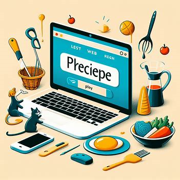

# 

###  🗨️ 팀명 : 

###  🔻 팀원
 
 <strong>&nbsp;&nbsp;배성민</strong>  
 <strong>&nbsp;&nbsp;한소혜</strong>  
 <strong>&nbsp;&nbsp;윤재은</strong>  
 <strong>&nbsp;&nbsp;조수빈</strong>  
 <strong>&nbsp;&nbsp;김재현</strong>  

## 🟥 1. 프로젝트 소개

> &nbsp;Plrecipe는 사용자 간의 경험 공유를 중심으로 한 서비스로, 매력적인 여행지 탐색과 개인 코스 조합, 사진 및 글 추가를 통한 게시글 작성 기능을 제공합니다. 이 서비스는 아기자기하고 귀여운 디자인으로 사용자에게 친근하게 다가가고자 하며, 이를 위해 프론트엔드 개발에 있어 CSS와 HTML을 적극 활용하여 직관적이고 사용자 친화적인 인터페이스를 구현하였습니다.  &nbsp; 로그인과 회원가입 과정에서는 CSS와 HTML을 통해 사용자에게 쉽게 접근할 수 있는 디자인을 마련하였고, Spring Boot를 활용한 백엔드 개발로 프론트엔드와 백엔드 간의 원활한 데이터 처리를 실현하였습니다. 또한, Vue와 JavaScript를 이용하여 동적인 웹 애플리케이션을 구축함으로써, 사용자들이 높은 상호작용성과 반응성을 경험할 수 있는 서비스를 제공하고 있습니다. 이를 바탕으로 서비스를 지속적으로 개선하고 발전시켜 나갈 예정입니다.

## 📝 Plrecipe Backend Project

> [!Tip]
> 해당 이미지를 클릭 시 Plrecipe Backend Project로 이동합니다.

## 💾 기술스택

|JavaSpring|SpringBoot|SpringSecurity|Vue|HTML|CSS|JavaScript|MariaDB|
|---|---|---|---|---|---|---|---|
|||||||||

## 🪄 개발도구

|IntelliJ IDEA|Visual Studio|HeidiSQL|Figma|
|---|---|---|---|
|||||

## 🟧 2. 요구사항 명세서

<a href="https://docs.google.com/spreadsheets/d/1s_xHKGkEtqTWraOUuyuyXDv-GDdMmeleYGFhPgfCvv4/edit#gid=354051830">요구사항 명세서</a>

## 🟨 3. 기능 명세서

<a href="https://docs.google.com/spreadsheets/d/1s_xHKGkEtqTWraOUuyuyXDv-GDdMmeleYGFhPgfCvv4/edit#gid=671784311">기능 명세서</a>

## 🟩 4. WireFrame

<b>WireFrame 개별 페이지</b>

➡️ 메인 페이지 
 

➡️ 마이페이지 
 

➡️ 게시판(게시글 페이지) 
 

➡️ 게시글 생성 
 

➡️ 게시글(단일) 
 

➡️ 장소(장소 페이지) 
 

➡️ 장소(단일) 
 

➡️ 장소 등록(생성) 
 

➡️ 장소 별점 등록 
 

➡️ 별점이 등록된 장소 
 

➡️ 에러 페이지(준비 페이지) 
 

 

###  - WireFrame

## 🟦 5. Story Board

<b>STORY BOARD</b>

 

## 🟪 6. 테스트 계획

<a href="https://docs.google.com/spreadsheets/d/1s_xHKGkEtqTWraOUuyuyXDv-GDdMmeleYGFhPgfCvv4/edit#gid=0">테스트 명세서</a>

## 🟫 7. 테스트

 
<b>1. Router</b>

  
➡️ 헤더 라우터 
 
 
➡️ 게시판 라우터
 
 
➡️ 장소 라우터
 
  
➡️ 마이페이지 라우터 
 

 
<b>2. Post</b>

   
➡️ 전체 게시글 조회 
 

  
➡️ 게시글 작성 라우터 
 

  
➡️ 단일 게시글 조회 
 

  
➡️ 즐겨찾기 
 

  
➡️ 게시글 등록 
 

  
➡️ 게시글 검색 
 

  
➡️ 단일 게시글 이동 
 

  
➡️ 코스 장소 이동 
 

 
<b>3. Place</b>

  
➡️ 전체 장소 조회 
 

  
➡️ 장소 단일 조회 
 

  
➡️ 장소 카테고리 조회 
 

  
➡️ 장소 등록 
 

  
➡️ 장소 검색 
 

  
➡️ 장소별 별점 조회 
 

  
➡️ 별점 등록 
 

  
➡️ 장소 단일 이동 
 
 

 
<b>4. Error</b>

  
➡️ Error Page 
 
 

 
<b>Login And Register</b>

https://github.com/beyond-sw-camp/be04-3rd-6candoit-plrecipe/assets/80388847/0f34aabf-193b-4c2b-899b-418addbac92b

## ⬜ 회고

|&nbsp;&nbsp;팀&nbsp;원&nbsp;&nbsp;&nbsp;|회고록|
|:---:|---|
|배성민|&nbsp;이번 프로젝트에서는 주로 프론트엔드에 초점을 맞추었습니다. Vue, HTML, CSS를 활용하여 아기자기하고 귀여운 컨셉의 인터페이스를 구현했고, Router와 Fetch를 이해하며 Vue의 동적 구성을 학습할 수 있었습니다. 제가 맡은 부분은 로그인과 회원가입 기능이었는데, 보안 측면에서 주의해야 할 점이 많았습니다. Oauth를 통한 제3자 로그인 방식을 도입하고, 프론트엔드와 백엔드 간의 데이터 처리에 있어 어려움을 겪기도 했습니다. 이 과정에서 HTML 파일의 수정이 필요했으며, 단순한 인증을 넘어 로그인 시 토큰을 발급하고 이를 통해 권한을 인증하는 시스템을 구축했습니다. 회원가입 시에는 사용자 정보를 암호화하여 저장했습니다. 제3자 로그인에 있어서는, DB에 저장된 정보와 LoginId 컬럼을 추가하여 카카오와 구글 로그인을 구분했으나, 네이버 로그인 구현에는 실패해 아쉬움이 남았습니다. &nbsp;향후 고도화 계획으로는 네이버 로그인을 성공적으로 구현하고, 발급된 회원 토큰을 기반으로 사용자별 다른 권한 부여가 가능하도록 하는 것입니다. 이를 통해 관리자 기능도 추가할 수 있을 것으로 기대합니다. 또한, 이전에 백엔드 프로젝트에서 진행한 MSA를 프론트엔드 프로젝트에 통합하여 서비스를 개선할 계획입니다. 프론트엔드에 중점을 둔 이번 프로젝트는 디자인과 기능적 측면에서 아쉬운 부분이 있음에도 불구하고, 팀원들과 충분히 협의하고 고려하여 결정한 결과물이기에 만족합니다. 성취감과 함께 개선할 부분에 대한 동기 부여도 얻은 의미 있는 프로젝트였습니다.|
|한소혜|&nbsp;이번 프로젝트는 데이터를 받아오기만 했던 지난 프로젝트와는 달리 지난번 구현한 데이터를 사용해 화면에 직접 표시하고 기능을 구현할 수 있었습니다. 저번 프로젝트때 장소를 주요 담당하여 구현했던 것과 같이 이번에도 장소 관련 페이지를 담당하여 구현하게 되었습니다. &nbsp;이전에 프론트를 배웠을 때는 직접 id와 class 등을 이용해 값을 받아오는 과정이 힘들었던 것 같은데 vue를 이용해 동적으로 쉽게 바뀌는 값들을 적용할 수 있어서 더 즐기면서 개발할 수 있었습니다. 프론트는 재밌다는 생각을 잘 못했던 것 같은데 이번 프로젝트는 코드를 짜는 것에 따라 기능이 하나씩 생겨나는걸 보면서 뿌듯하기도 하고 처음으로 프론트도 재밌다는 생각이 들었습니다. 라우터와 각 뷰를 연결하고 DefineProps와 emit 등을 이용해 다양한 시도를 해볼 수 있었습니다. 또 fetch를 이용해 받아온 데이터를 filter를 사용하여 계속해서 서버에 다녀오지 않고도 쉽게 검색이나 카테고리에 맞는 데이터를 표시해줄 수 있다는 것도 배우게 되었습니다. 팀원들과 함께 다양한 시도를 해보고 서로서로 도우며 기능을 구현할 수 있어서 의미있는 시간이었습니다. &nbsp;저번 프로젝트때 구현했던 백엔드 서버를 적용하지 않아서 조금 아쉬웠지만, 데이터를 받아와 원하는대로 화면에 띄우는 과정에서 다음 고도화를 통해 잘 해낼 수 있을것이라고 생각합니다.  이제는 이전에 저희가 개발했던 백엔드를 연결해 실제 db에 저장/수정/삭제 기능을 페이지에 제대로 구현하고 싶습니다.|
|윤재은|&nbsp;이번 프로젝트에서 저희 팀의 목표는 HTML, CSS, Vue, JavaScript를 사용하여 백엔드 프로젝트에서 상상했던 웹 화면을 실제로 구현하는 것이었습니다. 주요 기능으로는 로그인, 게시판, 장소, 마이페이지 등이 있었으며, 이들을 팀원들과 역할을 나누어 맡았습니다. &nbsp;프로젝트 동안, 매일 아침 진행 상황을 공유하는 시간을 가졌습니다. 이를 통해 막히는 부분이나 새로운 정보들을 서로 공유하며, 프로젝트를 더욱 효율적으로 진행할 수 있었습니다. Figma로 만들었던 웹 템플릿들을 구현하는 과정에서 모든 것을 완성하지는 못했지만, 게시판, 장소 같은 주요 기능들을 성공적으로 구현했고, 요소들의 배치와 데이터 통신과 같은 다양한 문제들을 하나씩 해결해 나가며 큰 성취감을 느꼈습니다. &nbsp;이전에 구현했던 백엔드 서버와의 통신을 완전히 구현하지는 못했지만, Json 데이터를 사용해 테스트 서버를 구축하여 통신을 시뮬레이션함으로써, 추후에 실제 백엔드와의 연결과 기능 추가를 원활하게 진행할 수 있을 것이라고 생각합니다. &nbsp;이번 프로젝트는 HTML, CSS의 동작 구조와 기본 문법, Fetch를 통한 API 서버 통신, JavaScript의 비동기 통신, 그리고 Vue를 사용한 Route 기술 등을 한번 더 깊이 공부할 수 있는 좋은 기회였습니다. 시간상의 이유로 이번에는 추가하지 못했지만, 향후에는 파일 업로드와 데이터 수정 등의 기능을 Fetch가 아닌 axios를 사용하여 구현해보고 싶습니다. &nbsp;이번 경험을 통해 프론트엔드 개발에 대한 더 깊은 이해와 함께 팀으로서의 협력과 문제 해결 능력이 크게 성장했다고 느낍니다. 아쉬운 점도 있었지만, 이러한 경험들이 향후 프로젝트에서 더 나은 개발자로 성장하는 데 큰 도움이 될 것 같습니다.|
|조수빈|&nbsp;백엔드 작업까지만 구현했던 이전 프로젝트(Plrecipe)의 프론트 작업을 팀 프로젝트로 진행해 보았습니다. 팀프로젝트 구현 전 JavaScript, CSS, HTML, VUE, BootStrap, React, Router 등 다양한 프론트 기술들을 배우면서 이론적인 부분이나 단순한 실습 예제뿐만 아니라, 배운 기능들을 어떻게 팀프로젝트에 적용할지 혼자 고민해보기도 하고 팀원들과 의견을 공유하며 빠르게 체득할 수 있었습니다. &nbsp;프론트 프로젝트인만큼 프론트엔드 기능 구현에 중점을 두고 실제 기능 구현 없이, 프론트 화면상에서 시각적으로만 표현한 기능들도 있었습니다. 프로젝트 막바지로 접어들 때는 팀원들 모두가 욕심을 가지고 실제 기능까지 구현해보았습니다. 혼자 작업했다면 일정 수준에서 만족했을 수도 있었지만, 팀원들끼리 협업하고, 쉽게 해결되지 않는 오류들을 같이 해결하며 팀 프로젝트의 장점을 느꼈습니다. &nbsp;axios를 활용해 직접 구현했던 백엔드 서버와 직접 통신하며 데이터베이스에 있는 데이터를 활용하기도 하고, JSON local server에 직접 데이터를 저장해 활용하는 최종 방식까지 다양한 방법들을 통해 프론트 작업을 하며 자연스럽게 백엔드 프로젝트도 복습할 수 있었습니다. &nbsp;성취감 측면에서 아쉬웠던 이전 프로젝트에 비해, 이번 프로젝트에서는 더 많은 오류들을 직면하고 스스로 해결해 나가며 더욱 성장하고 개발에 흥미를 느끼며 많은 걸 배울 수 있었습니다.|
|김재현|&nbsp;백엔드 프로젝트를 하며 데이터를  DB에서 가져와 console창에 띄우고 하는 과정과 다르게 이번 프론트 프로젝트에서는 DB에서 fetch나 axios로 json파일을 받아와 내가 html,css,js 코드로 구현한 페이지에 띄우는 과정이 너무 새롭고 흥미로운 과정이였습니다. &nbsp;이번에 내가 구현한 그룹페이지는 마이페이지 구현을 추후에 구현하기로 결정하면서 프로젝트 발표에는 보여주지 못하게되고, 이번 프로젝트에 많은 기여를 하지 못한것이 아쉽지만 발표이후에도 계속 고도화하여 맡은 페이지를 완전하게 구현하고 싶은 욕심이 생겼습니다. &nbsp;또한 예전 졸업프로젝트 당시 프론트 작업을 했던 기억이 났는데 그때는 그저 html, css, js코드만 겨우겨우 작성해 DB에 값을 넣기만하고 동적으로 화면에 데이터를 띄우는 것은 시도조차 못했었는데, 이번 프로젝트를 하며 html,css,js코드를 vue형식으로 수정도 해보고 , 양방향 바인딩도 시도해보며 서버와 프론트간의 연결을 구현하는 과정에 대해 이해하며 조금이라도 성장한것을 느껴볼 수 있었습니다. &nbsp;다만 vue나 다른 javascript에 대한 내용의 이해도가 떨어져서 이번 프로젝트때 의견 제시할 때나 코드리뷰등을 할 때 소극적이였던 점을 반성하게 됐고, 지속적으로 녹화영상, 코드등을 복습해서 다음 최종 프로젝트 시에는 적극적으로 참여해 더 많은 기여를 하고 싶습니다.  
